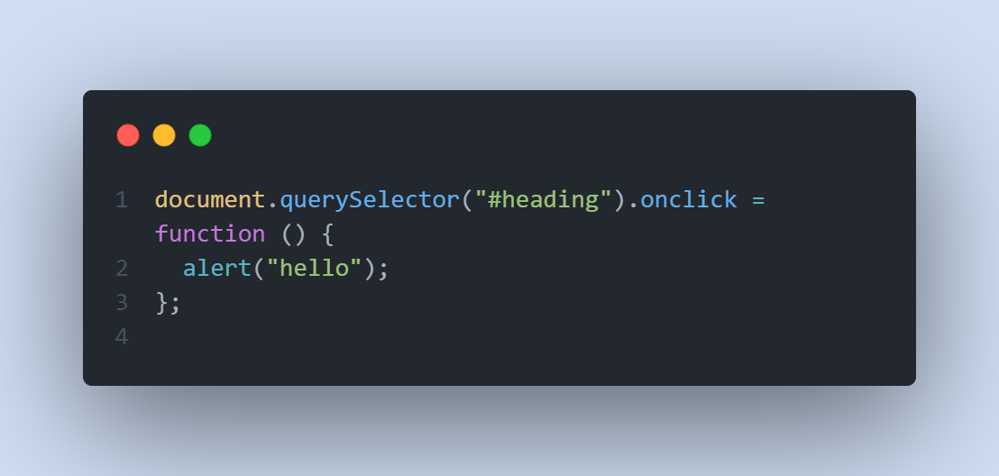

## Writing Test week 2 Web Development Basic      
### Scope dalam Javascript     
- Scope menentukan suatu variabel dapat diakses pada scope tertentu atau tidak          
-  Blocks adalah code yang berada di dalam curly braces atau {}. Conditional, looping, function dalam javascript menggunakan curly braces
-  Global Scope merupakan variabel yang dapat kita akses secara global atau dimanapun dalam suatu file. Untuk menjadikannya global scope, kita harus mendeklarasikannya di luar Blocks
  <!-- Image Global Scope -->
- Local Scope merupakan variabel yang kita deklaraikan di dalam blokcs seperti pada function, looping, conditional. Oleh karena itu, variabel tersebut hanya dapat diakses di dalam blocks saja
<!-- Image local scope -->

### Tipe Data di Javascript
Dalam Javascript, terdapat beberapa tipe data. tipe-tipe data tersebut dikelompokkan menjadi tipe data primitive dan tipe data non-primitive.   
- Tipe data Primitive:
    - String
  
    - Number
  
    - Boolean
  
- Tipe data non primitive:
    - Array
  
    - Object 
  
### Property dan Method dalam Javascript 
- Property yang ada di dalam string:
  - typeof : mengetahui tipe data
  
  - length : untuk mengetahui berapa banyak karakter
  
- Method yang dimiliki dalam string
Method adalah sebuah function dalam javascript
  - toUpperCase()
  
  - toLowerCase()
  
- Method yang ada di dalam number
  - isNaN() = Mengecek apakah angka atau bukan
  
  - toString() = merubah tipe data number menjadi string
  
## Math
Math merupakan objek yang sudah disediakan oleh javascript
- Math Method
  - Math.abs () = mengembalikan nilai absolut dari angka
  
  - Math.pow() = mencari nilai pangkat
  
  - Math.sqrt() = mencari akar bilangan
  
  - Math.round() = membulatkan bilangan
  
  - Math.floor() = membulatkan bilangan ke bawah
  
  - Math.ceil() = membulatkan bilangan ke atas
  
  - Math.random() = membuat bilangan random
  
## Document Object Model (DOM)
- ### Definisi DOM
DOM adalah jembatan agar bahasa pemograman dapat berinteraksi dengan dokumen HTML. Dengan DOM, Javascript dapat memanipulasi HTML. DOM bukan milik Javascript namun milik web browser. DOM berbentuk Tree Structure
File HTML -> load -> DOM
- ### Traversing
  - getElementByID = mengakses element berdasarkan ID
  
  Kita dapat akses dengan: 
  
  - getElementsByClassName = mengakses element berdasarkan class name
  
  Kita dapat akses dengan:
  
  - querySelector = mengakses element berdasarkan selector
  
  - children = mengakses anak dari parent element
  
  - previousSibling = mengakses element setara sebelumnya
  
  - nextSibling = mengakses element setara setelahnya
  
- ### DOM Manipulation
Memanipulasi element HTML dengan DOM
  - innerHTML = memasukkan tag html ke element HTML
  
  - innerText = memasukkan teks ke dalam element HTML
  
  - createElement = membuat element baru
  
  - append = menyisipkan element baru tersebut ke dalam HTML
  
  - getAttribute = mengakses atribut tertentu dari element HTML
  
  - setAttribute = menambahkan atribut tertentu ke element HTML
  
  - style = melakukan styling element HTML
  
- ### DOM events
Events adalah kejadian/interaksi yang terjadi pada website
  - Terdapat 3 cara dalam memberikan events:
    - HTML Attribute
  
    - Event Property
  
    - addEventListener() 
  
  - Event
    - click
   
    - submit
  
    - focus
  
    - hover
  
  - Form
  Kita dapat mengambil hasil dari user input pada form yang kita buat dengan DOM. yaitu dengan cara:
  